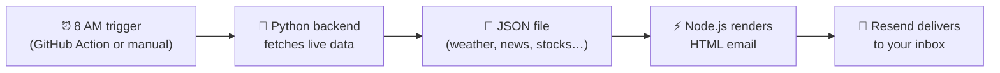
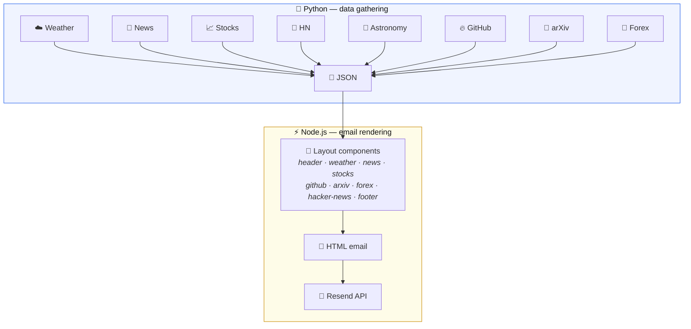
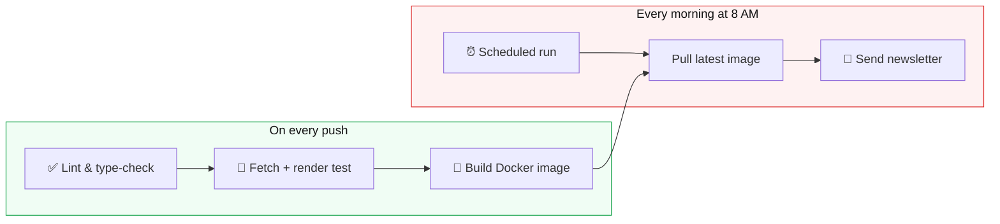

<h1 align="center">📰 每日简报 — Daily Briefing Newsletter</h1>

<p align="center">
  A personal, automated Chinese-language morning newsletter —<br>
  weather, world news, stocks, and more, delivered to your inbox every day.
</p>

<p align="center">
  <a href="#how-it-works">How It Works</a> •
  <a href="#getting-started">Getting Started</a> •
  <a href="#customise-your-newsletter">Customise</a> •
  <a href="#deploying-with-github-actions">Deploy</a>
</p>

---

## Why This Exists

I wanted a calm, newspaper-style morning email in Chinese that rounds up the things I care about — weather, headlines, stock tickers, and interesting Hacker News posts. Everything runs automatically: a GitHub Action fires at 8 AM, gathers live data, renders a beautiful email, and sends it.

---

## Where the Data Comes From

Almost everything is **free with no API keys**:

| Section | Source | What You Get |
|---------|--------|-------------|
| ☁️ Weather & forecast | [Open-Meteo](https://open-meteo.com) | Current conditions, 3-day forecast, sunrise/sunset |
| 📰 World news | RSS feeds (NYT, BBC, Guardian, NPR, Al Jazeera) | Top headlines, translated to Chinese |
| 📈 ETFs & Stocks | [yfinance](https://github.com/ranaroussi/yfinance) | Price, daily change, percentage for your tickers |
| 🔶 Hacker News | [HN Firebase API](https://github.com/HackerNews/API) | Top stories with Chinese-translated titles |
| 🔥 GitHub Trending | [GitHub Trending](https://github.com/trending) | Hot repos in Rust, Go, Python (scraped) |
| 📄 arXiv Papers | [arXiv API](https://arxiv.org/help/api) + [Gemini AI](https://ai.google.dev) | Latest LLM & HPC papers with AI summaries |
| 💱 Exchange Rates | [yfinance](https://github.com/ranaroussi/yfinance) | USD/CNY and other forex pairs |
| 🌅 Astronomy | [astral](https://github.com/sffjunkie/astral) | Sunrise, sunset, golden hour, day length |
| 🌐 Translation | Google Translate (free tier) | English → Chinese for headlines and summaries |

**Optional API key:** [Gemini AI](https://ai.google.dev) produces better arXiv summaries, but the section works without it (falls back to Google Translate). The **only paid thing** is [Resend](https://resend.com) for email delivery — and their free tier (100 emails/day) is more than enough.

---

## How It Works



1. **Fetch** — Python pulls fresh data from all the free APIs listed above, in parallel
2. **Translate** — Headlines and summaries are translated to Chinese via Google Translate
3. **Render** — The data is passed to React Email components that produce a styled HTML email (warm ivory background, calligraphy title, newspaper-inspired layout)
4. **Send** — The HTML is sent through the Resend API to your email address



---

## Getting Started

You need **four things** installed:

- [Node.js](https://nodejs.org) (v20+) and [Yarn](https://yarnpkg.com) — for the email renderer
- [Python](https://python.org) (3.11+) and [uv](https://docs.astral.sh/uv/) — for the data fetcher

```bash
# Clone the repo
git clone https://github.com/<your-user>/newsletter.git
cd newsletter

# Install everything (Node packages, Python packages, proto stubs)
make setup

# Fetch live data and preview the email in your browser
make preview
```

That's it — `make preview` will open a local preview with real data. No API keys needed for previewing.

### Sending a Real Email

To actually deliver the email, you need a free [Resend](https://resend.com) account:

1. Sign up at [resend.com](https://resend.com) and grab an API key
2. Set up your `.env` file:

```bash
cp .env.example .env
# Then edit .env and fill in:
#   RESEND_API_KEY=re_xxxxxxxxxxxx
#   RECIPIENT_EMAIL=you@example.com
```

3. Send:

```bash
make send
```

---

## Customise Your Newsletter

Everything is configured in one file: [`newsletter.config.yaml`](newsletter.config.yaml).

**Change your location** (affects weather and astronomy):
```yaml
weather:
  latitude: 37.3688
  longitude: -122.0363
  location: "圣尼维尔，加州"
```

**Pick your ETFs/stocks:**
```yaml
stocks:
  symbols: [QQQ, VOO, GLD, SLV, TSLA, NVDA]
```

**Reorder or hide sections** (just comment out what you don't want):
```yaml
sections:
  - id: header
  - id: weather
  - id: top-news
  - id: github-trending
  - id: arxiv
  - id: exchange-rates
  # - id: hacker-news   ← hidden
  - id: stocks
  - id: footer
```

Run `make preview` after editing to see your changes instantly.

---

## Deploying with GitHub Actions

The project includes two workflows that handle everything automatically:



### Setup

1. Push this repo to GitHub
2. Go to **Settings → Secrets and variables → Actions** and add:
   - `RESEND_API_KEY` — your Resend API key
   - `RECIPIENT_EMAIL` — where to deliver the newsletter
   - `GEMINI_API_KEY` *(optional)* — for AI-powered arXiv summaries
3. That's it! The newsletter will send automatically every morning

You can also trigger a send manually: **Actions → Daily Newsletter → Run workflow**.

---

## Useful Commands

| Command | What it does |
|---------|-------------|
| `make setup` | Install all dependencies |
| `make preview` | Fetch live data → render → open in browser |
| `make send` | Fetch live data → render → send email |
| `make fetch` | Fetch data only (saves to a JSON file) |
| `make lint` | Check code for errors |
| `make e2e` | Full test run without sending email |
| `make docker-build` | Build the Docker image |
| `make clean` | Remove caches and temporary files |

---

## Project Layout

```
newsletter/
├── newsletter.config.yaml    ← All your settings live here
├── .env.example              ← Template for secrets
├── Makefile                  ← All the commands above
├── Dockerfile                ← For running in production
├── packages/
│   ├── backend/              ← Python: fetches data from APIs
│   │   └── src/
│   │       ├── services/     ← One file per data source
│   │       ├── config.py     ← Reads your YAML config
│   │       └── fetch.py      ← Runs all fetchers → outputs JSON
│   └── email-service/        ← Node.js: renders & sends the email
│       ├── emails/
│       │   ├── newsletter.tsx        ← Main email template
│       │   └── components/           ← Visual building blocks
│       └── src/
│           ├── send-real.ts          ← Production send script
│           └── preview.ts            ← Local preview script
└── .github/workflows/
    ├── ci.yml                ← Runs tests on every push
    └── daily.yml             ← Sends newsletter every morning
```

---

## License

[MIT](LICENSE) — Ziyi Xi
