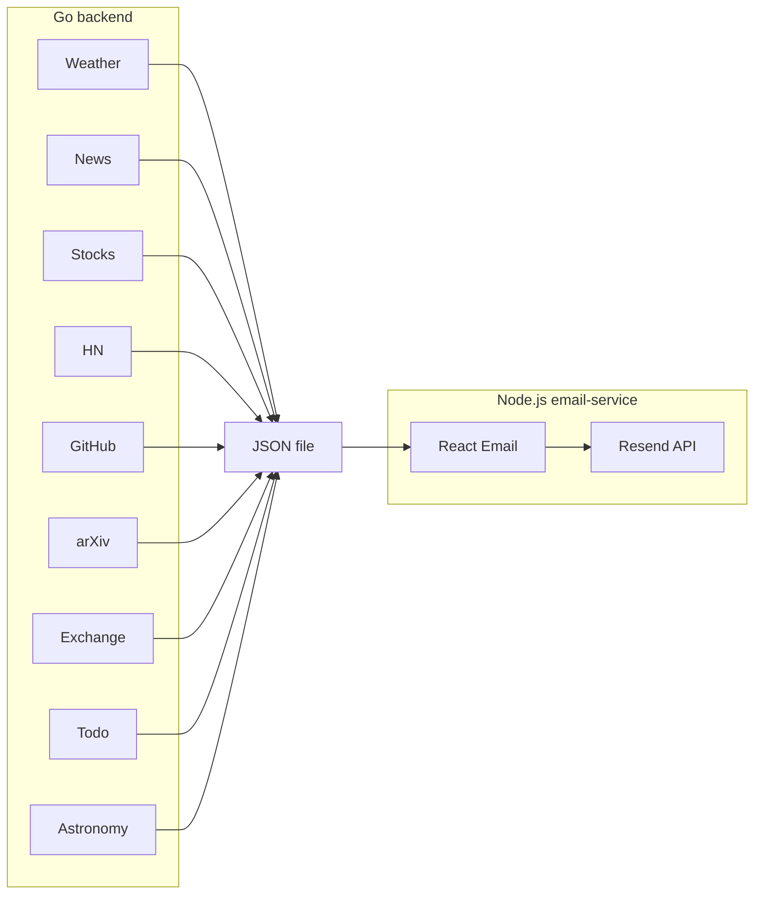

# 每日简报 — Daily Newsletter

A personal daily newsletter that curates content from multiple sources and delivers a beautifully formatted email every morning.

## Architecture


```mermaid
graph LR
    subgraph "Go backend"
        W[Weather] & N[News] & S[Stocks] & H[HN] & G[GitHub] & A[arXiv] & E[Exchange] & T[Todo] & As[Astronomy]
    end

    subgraph "Node.js email-service"
        R[React Email] --> Re[Resend API]
    end

    W & N & S & H & G & A & E & T & As --> J["JSON file"]
    J --> R
```

| Package | Language | Purpose |
|---------|----------|---------|
| `packages/backend` | Go 1.24 + Protobuf | Fetches data from external APIs in parallel |
| `packages/email-service` | TypeScript (Node 20) | Renders React Email templates and sends via Resend |

They communicate through a **JSON file** — the backend writes it (via `protojson`), the email-service reads it.

## Content Sources

| Section | Source | API Key? |
|---------|--------|----------|
| Weather | Open-Meteo | No |
| Astronomy | `go-sunrise` | No |
| Top News | RSS feeds + Google Translate | No |
| Hacker News | Firebase API + Google Translate | No |
| Stocks | Yahoo Finance HTTP API | No |
| Exchange Rates | Yahoo Finance HTTP API | No |
| GitHub Trending | HTML scraping + Google Translate | No |
| arXiv Papers | arXiv Atom API + Gemini | Yes (`GEMINI_API_KEY`) |
| Todo Tasks | daily.ziyixi.science | Yes (`TODO_API_*`) |

## Quick Start

```bash
# 1. Install dependencies
make setup

# 2. Configure secrets
cp .env.example .env   # edit with your API keys

# 3. Preview in browser (fetches real data)
make preview

# 4. Send the newsletter
make send
```

## Configuration

All settings live in **`newsletter.config.yaml`** — a single source of truth for both packages.

Secrets go in **`.env`** (local) or **GitHub Secrets** (CI):

```
RESEND_API_KEY=re_...
RECIPIENT_EMAIL=you@example.com
RECIPIENT_NAME=Ziyi
GEMINI_API_KEY=AIza...
TODO_API_USER=...
TODO_API_PASSWORD=...
```

## Development

```bash
# React Email dev server (hot reload)
make dev-email

# Run all linters (TypeScript + Go)
make lint

# Fetch data only (without sending)
make fetch

# Regenerate protobuf Go code after editing proto/newsletter.proto
make proto

# Run integration tests (Docker Compose)
make test
```

## Testing

Integration tests use Docker Compose with a **fake server** that returns canned responses for all external APIs:

```bash
make test
# → docker compose -f docker-compose.test.yml up --build ...
```

The fake server lives in `tests/fake-server/` with fixture files for each API endpoint.

Backend services support configurable base URLs via environment variables (`WEATHER_API_BASE`, `HN_API_BASE`, etc.) and skip flags (`SKIP_STOCKS=true`).

## Docker

```bash
# Build
docker build -t newsletter .

# Send
docker run -e RESEND_API_KEY=... -e RECIPIENT_EMAIL=... newsletter send

# E2E validation (no email sent)
docker run newsletter e2e
```

## Project Structure


```mermaid
graph TD
    subgraph "Root"
        Config["newsletter.config.yaml"]
        Make["Makefile"]
        Docker["Dockerfile"]
        Compose["docker-compose.test.yml"]
    end

    subgraph "packages/backend (Go)"
        Proto["proto/newsletter.proto"]
        PB["pb/newsletter.pb.go &#40;generated&#41;"]
        CMD["cmd/newsletter/main.go"]
        CFG["internal/config/config.go"]
        Fetcher["internal/fetcher/fetcher.go"]
        SVC["internal/service/*.go"]
    end

    subgraph "packages/email-service (TypeScript)"
        Emails["emails/newsletter.tsx"]
        Types["emails/types.ts"]
        Sections["emails/components/*.tsx"]
        Send["src/send-real.ts"]
        E2E["src/e2e.ts"]
        Preview["src/preview.ts"]
    end

    subgraph "tests/"
        Fake["fake-server/server.py"]
        Fixtures["fake-server/fixtures/"]
    end

    subgraph "scripts/"
        Entry["entrypoint.sh"]
    end

    subgraph ".github/workflows/"
        CI["ci.yml"]
        Daily["daily.yml"]
    end

    Proto --> PB
    CMD --> Fetcher --> SVC
    SVC --> |"JSON via protojson"| Emails
    CFG --> SVC
```

## License

MIT
